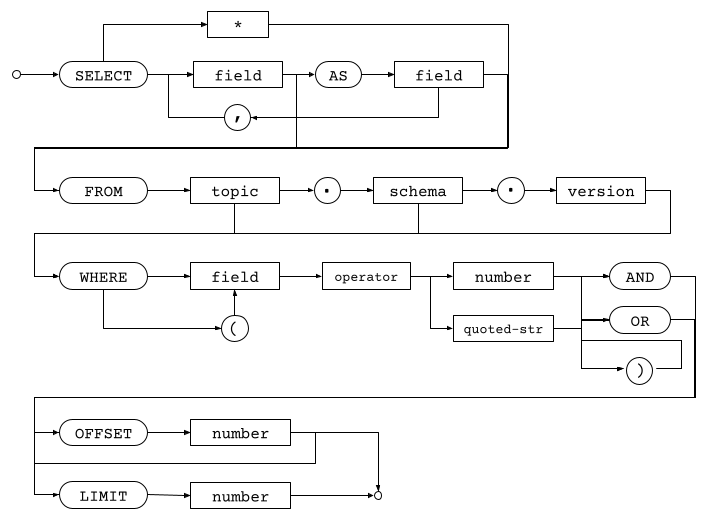

Ensign supports querying using standard `SELECT` statements using the following basic syntax:



### SELECT

`SELECT` is used as to begin an EnSQL statement to query events from a topic.

Syntax is as follows:

```
SELECT * | { field_name[ AS field_alias] }
```

To select all fields from a specified topic, you would use:

```
SELECT * FROM <topic>
```

However, you can also specify one or more field names with optional aliases to create a _projection_ of the fields that you would like to return. For example, given an event that has the fields `id`, `timestamp`, `sensor`, `reading`, you can specify only a subset of the fields as follows:

```
SELECT timestamp, reading FROM <topic>
```

You can also alias fields in the returned result using `AS`:

```
SELECT reading AS sensor_reading FROM <topic>
```

### FROM

Specifies the topic to use in a `SELECT` statement optionally with the schema and version of an event type in order to support robust queries.

Syntax is as follows:

```
SELECT ...
FROM <topicReference>
```

Where:

```
topicReference := <topic_name>[.<schema_name>[.<schema_version>]]
```

`SELECT` statements are required to have a `FROM` clause.

### WHERE

A `WHERE` clause specifies conditions that act as a filter to ensure that only events that meet the predictate defined by the `WHERE` clause are returned.

Syntax is as follows:

```
WHERE <predicate>
```

Such that:

```
predicate :=
    -- expression
    <field> <operator> <value> |

    -- logical operator
    <expression> <logical operator> <expression> |

    -- parenthetical grouping
    (<expression> <logical operator> <expression>) <logical operator> <expression>
```

See [Query Operators]() for more detail on expression and logical operators.

### LIMIT

Constrains the maximum number of events returned by a query.

Syntax:

```
SELECT ...
FROM ...
LIMIT <count>
```

Where `<count>` is a numeric value that specifies the maximum number of events returned.

### OFFSET

Offset specifies where the query should start in the event stream. While `OFFSET` is typically used in conjunction with `LIMIT`, unlike in standard SQL, it is not necessary to specify a `LIMIT` to use `OFFSET` since all events are totally ordered.

Syntax:

```
SELECT ...
FROM ...
OFFSET <start>
```

Where `<start>` is one of the following:

1. A numeric integer, specifies how far from the beginning of the stream to start returning events. E.g. `OFFSET 100` will start returning events afters skipping the first 99 events.
2. An event ID as a quoted string, specifies a specific event ID to start querying from.

### BEFORE | AFTER

**Coming soon!**

The `BEFORE` and `AFTER` statements allows EnSQL users to specify queries relative to time or event ordering. EnSQL does not currently have an `ORDER BY` clause since data is returned in time ordering; the `BEFORE` and `AFTER` statements allow users to traverse events either forward or backward in time.