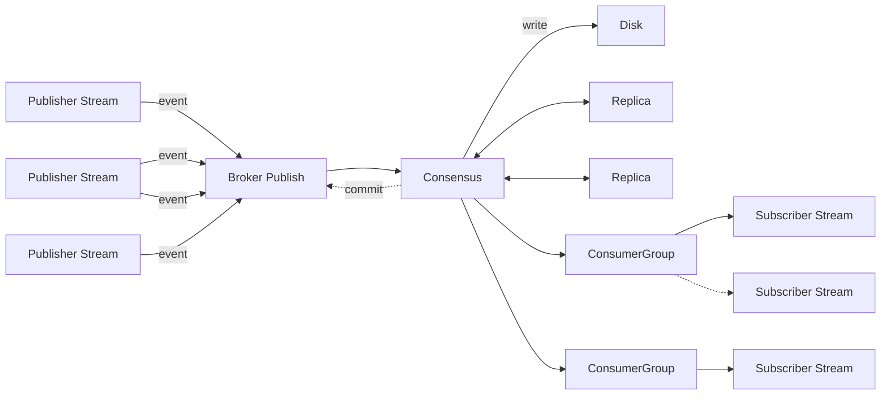

```mermaid
flowchart LR
    PubStream1[Publisher Stream]
    PubStream2[Publisher Stream]
    PubStream3[Publisher Stream]

    Pub[Broker Publish]
    Consensus
    Disk

    Follower1[Replica]
    Follower2[Replica]

    PubStream1 -- event --> Pub
    PubStream2 -- event --> Pub
    PubStream2 -- event --> Pub
    PubStream3 -- event --> Pub


    Pub-->Consensus
    Consensus <--> Follower1
    Consensus <--> Follower2

    Consensus -. commit .-> Pub
    Consensus -- write --> Disk

    CG1[ConsumerGroup]
    CG2[ConsumerGroup]

    SubStream1[Subscriber Stream]
    SubStream2[Subscriber Stream]
    SubStream3[Subscriber Stream]

    Consensus --> CG1
    Consensus --> CG2

    CG1 --> SubStream1
    CG1 -.-> SubStream2
    CG2 --> SubStream3
```